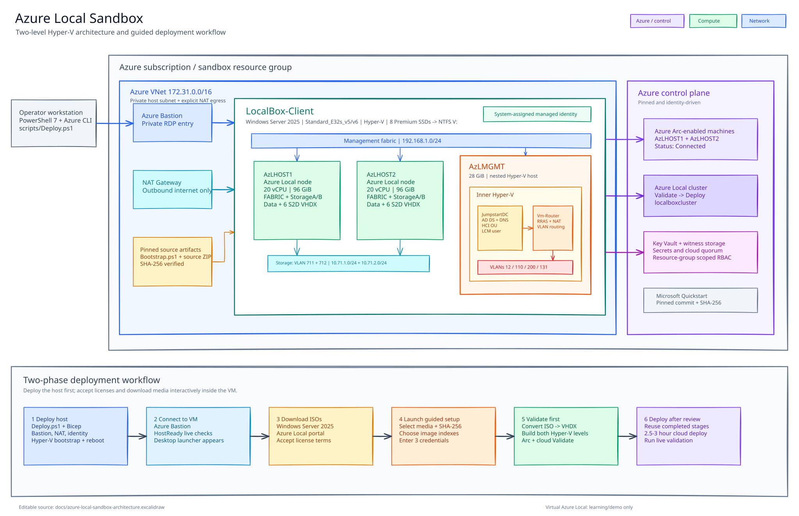

# Azure Local Sandbox

Deploy a two-node Azure Local learning environment inside one Azure VM. The outer
Windows Server 2025 VM runs Hyper-V and hosts two Azure Local nodes plus a nested
management host for Active Directory, DNS, and routing.

This project is intended for labs and demonstrations. Virtual Azure Local is not
supported by Microsoft Support and the environment is not suitable for production
workloads.



[Deployment guide](docs/DEPLOYMENT.md) |
[Troubleshooting](docs/TROUBLESHOOTING.md) |
[Technical reference](docs/TECHNICAL.md) |
[Stage contract](docs/STAGE-CONTRACT.md)

## What It Builds

- A private `Standard_E32s_v6` Azure VM with Bastion and NAT Gateway.
- `AzLHOST1` and `AzLHOST2` as nested Azure Local nodes.
- `AzLMGMT` as a nested Hyper-V host running `JumpstartDC` and `Vm-Router`.
- Active Directory, DNS, routing, Azure Arc registration, and Azure Local cloud deployment.
- A sandbox-owned Log Analytics workspace with a capped daily ingestion budget.
- A guided desktop setup for selecting licensed ISO media and resuming failed stages.

## Prerequisites

- An Azure subscription with sufficient permissions and `E32s` quota.
- PowerShell 7.2+, Azure CLI, and Git on the deployment workstation.
- Windows Server 2025 and Azure Local ISO media downloaded from authorized Microsoft sources.
- A clean Git commit containing the exact source being deployed.

The lab is expensive while running and continues to incur disk, Bastion, and NAT
charges while the VM is deallocated. The default `centralus` host region offers
the free Azure Bastion Developer SKU, which the deployment selects automatically.

Approximate pay-as-you-go costs (Central US, `Standard_E32s_v6` with 8× 1 TiB
Premium SSD data disks):

| State | Cost |
|---|---|
| Running | ~$3.90/hour (~$94/day) |
| Deallocated | ~$1.70/hour (~$41/day) |

Deallocated cost is disk charges only (9× P30). Deallocate the VM when not in use
and delete the resource group when the lab is no longer needed.

## Quick Start

Authenticate and select the subscription:

```powershell
az login
az account set --subscription '<subscription-id>'
```

Set the outer VM administrator password and deploy:

```powershell
$env:AZURE_LOCAL_SANDBOX_ADMIN_PASSWORD = '<strong-password>'

./scripts/Deploy.ps1 `
  -Mode Deploy `
  -Location centralus `
  -AzureLocalLocation eastus
```

The deployment installs Hyper-V, creates storage and networking, stages the exact
Git commit through temporary private Azure Storage, and reboots the VM once.

After deployment:

1. Connect to `LocalBox-Client` through Azure Bastion.
2. Download the Windows Server 2025 and Azure Local ISOs inside the VM.
3. Double-click **Azure Local Sandbox Setup** on the desktop.
4. Select both ISOs, choose their image indexes, and enter the requested credentials.
   The Windows Server index must be a `(Desktop Experience)` image.
5. Choose **Validate** first.
6. After validation succeeds, launch setup again and choose **Deploy**.

Cloud deployment normally takes 2.5 to 3 hours. Completed stages and verified
images are reused when setup is launched again.

See the [deployment guide](docs/DEPLOYMENT.md) for media requirements, regional
options, command-line setup, and validation commands.

## Validation

Run the local repository checks before release or dependency updates:

```powershell
Set-PSRepository PSGallery -InstallationPolicy Trusted
Install-Module Pester -RequiredVersion 6.0.1 -Scope CurrentUser -Force
Install-Module PSScriptAnalyzer -RequiredVersion 1.25.0 -Scope CurrentUser -Force
./tests/Invoke-Tests.ps1
```

These checks compile Bicep, run PSScriptAnalyzer, verify architecture and security
contracts, and compare generated parameters with the pinned Microsoft Quickstart
template. A real Azure `Validate` and `Deploy` remain the environment-specific
integration tests.

## Project Status

The source and contract tests pass, but this repository has not yet completed a
real paid deployment with licensed media. Results can still vary by subscription
policy, quota, region, ISO build, and Azure service behavior.

## License

Licensed under the [MIT License](LICENSE). Microsoft products, services,
trademarks, operating-system media, and third-party dependencies remain subject
to their respective terms.
